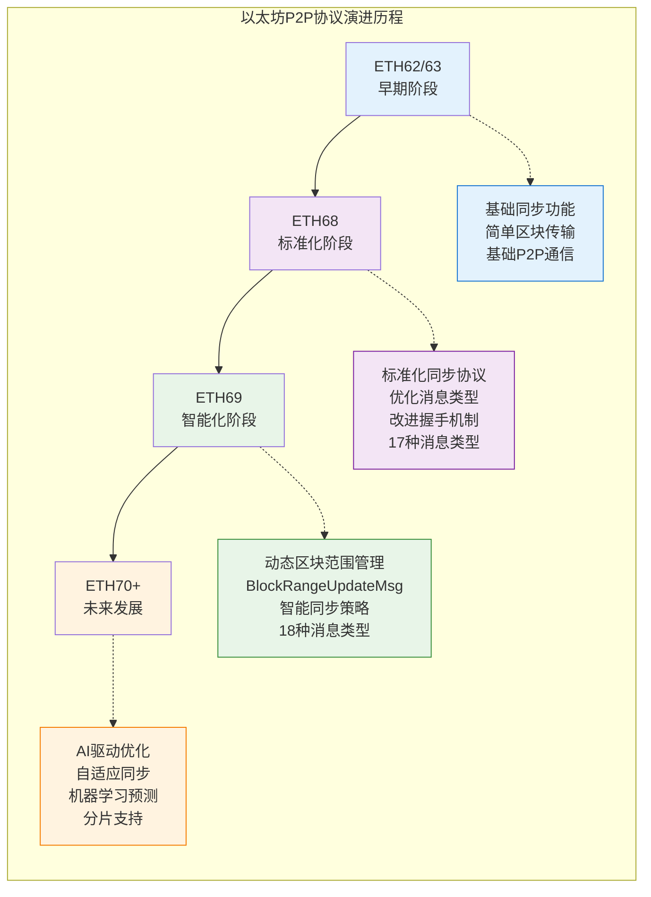
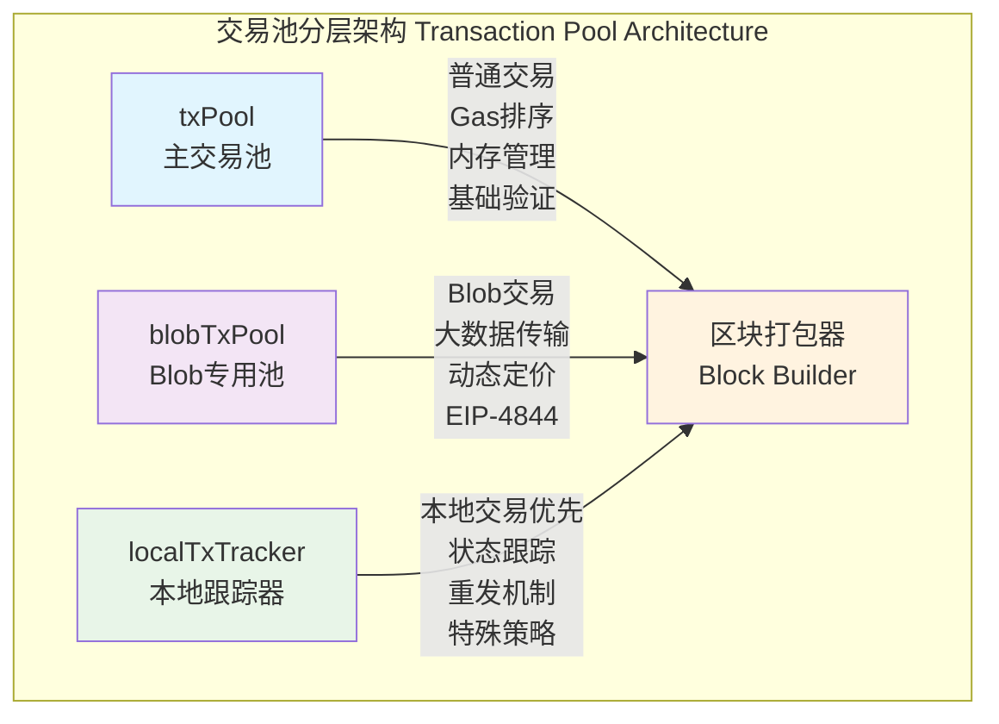
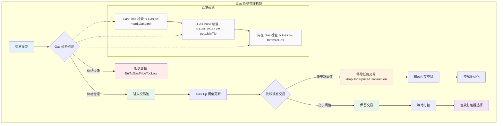
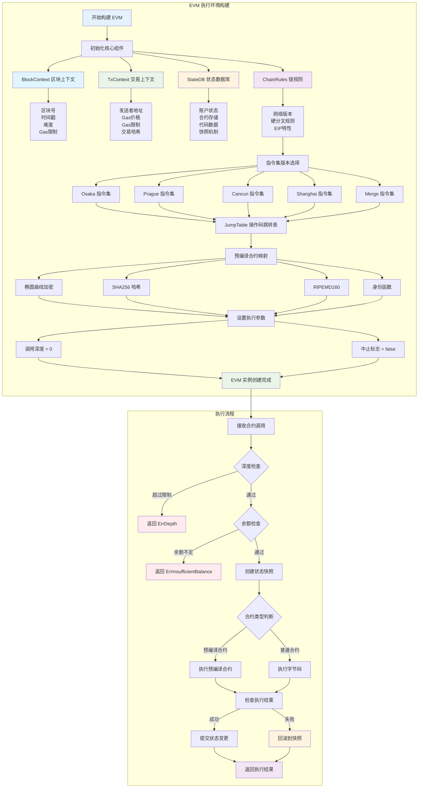
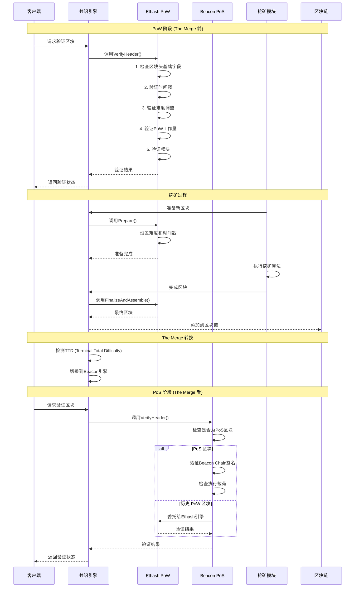
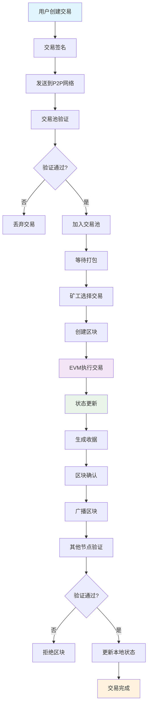
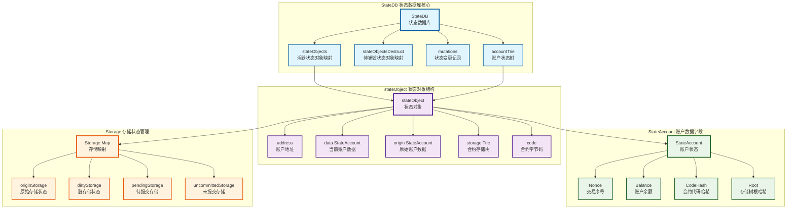
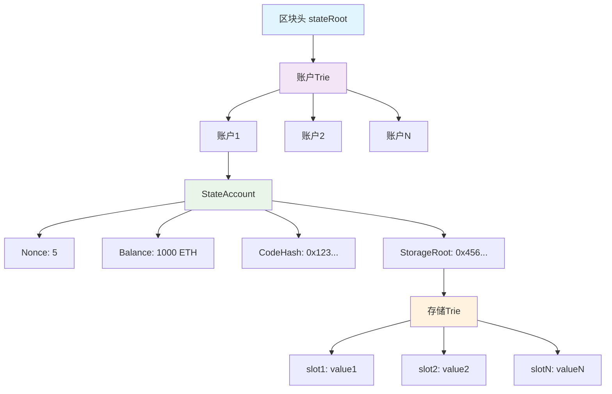

# Geth 深度分析研究报告

## 摘要

本报告深入分析了 Go Ethereum (Geth) 在以太坊生态中的定位、核心模块交互关系、分层架构设计以及实践验证。通过源码分析、架构设计和实际运行测试，全面解析了 Geth 作为以太坊主要执行层客户端的技术实现和关键特性。

**关键词**: Geth, 以太坊, 区块链, EVM, 共识算法, 状态管理

---

## 1. 引言

### 1.1 研究背景

Go Ethereum (Geth) 是以太坊网络的核心执行层客户端，在以太坊生态系统中扮演着至关重要的角色。随着以太坊 2.0 的合并完成，Geth 作为执行层客户端的重要性更加凸显。深入理解 Geth 的架构设计和实现机制，对于区块链技术研究、开发实践和系统优化具有重要意义。

### 1.2 研究目标

- 分析 Geth 在以太坊生态中的定位和核心作用
- 解析核心模块间的交互关系和工作机制
- 设计并绘制分层架构图
- 通过实践验证关键功能
- 分析账户状态存储模型

### 1.3 研究方法

采用源码分析、架构设计、实践验证相结合的方法，通过深入研读 Geth v1.16.3 源码，结合实际运行测试，全面分析 Geth 的技术实现。

---

## 2. 理论分析

### 2.1 Geth 在以太坊生态中的定位

#### 2.1.1 核心角色定位

Geth 在以太坊生态中扮演以下关键角色：

**1. 全节点实现**

- 维护完整的区块链状态和历史数据
- 提供完整的区块验证和同步功能
- 支持从创世区块到最新区块的完整数据

**2. 执行层客户端**

- 在以太坊 2.0 合并后，专门负责交易执行和状态管理
- 与共识层（Beacon Chain）协同工作
- 处理智能合约的执行和状态转换

**3. 网络基础设施**

- 提供 P2P 网络连接和节点发现
- 实现区块同步和交易传播
- 支持多种网络协议（eth/68, eth/69）

**4. 开发者工具**

- 提供丰富的 RPC API 接口
- 支持多种开发工具和调试功能
- 提供 JavaScript 控制台和 Web3 接口

#### 2.1.2 技术架构特点

```go
// Geth核心结构体现了其在以太坊生态中的核心地位
type Ethereum struct {
    config         *ethconfig.Config    // 配置管理
    txPool         *txpool.TxPool       // 交易池管理
    blobTxPool     *blobpool.BlobPool   // Blob交易专用池
    blockchain     *core.BlockChain     // 区块链核心
    handler        *handler             // 网络处理器
    engine         consensus.Engine     // 共识引擎
    miner          *miner.Miner         // 挖矿模块
    p2pServer      *p2p.Server          // P2P网络服务
    chainDb        ethdb.Database       // 区块链数据库
    accountManager *accounts.Manager    // 账户管理器
    gasPrice       *big.Int             // Gas价格管理
}
```

### 2.2 核心模块交互关系分析

#### 2.2.1 区块链同步协议（eth/68, eth/69）

**协议版本演进**：

```go
const (
    ETH68 = 68  // 支持基础同步功能
    ETH69 = 69  // 增加区块范围更新功能
)
var ProtocolVersions = []uint{ETH69, ETH68}
```

**核心特性**：

- **多版本支持**：同时支持 eth/68 和 eth/69 协议版本
- **区块范围管理**：eth/69 引入 `BlockRangeUpdateMsg`，支持动态区块范围更新
- **消息类型**：支持 17-18 种不同消息类型，包括区块头、区块体、交易、收据等
- **握手机制**：通过 `StatusPacket`进行网络握手，验证网络 ID、创世区块等

**协议技术演进路径**：



**同步流程**：

```go
func (h *handler) runEthPeer(peer *eth.Peer, handler eth.Handler) error {
    // 1. 执行以太坊握手
    if err := peer.Handshake(h.networkID, h.chain, h.blockRange.currentRange()); err != nil {
        return err
    }
    // 2. 注册对等节点
    if err := h.peers.registerPeer(peer, snap); err != nil {
        return err
    }
    // 3. 注册到下载器
    if err := h.downloader.RegisterPeer(peer.ID(), peer.Version(), peer); err != nil {
        return err
    }
    return handler(peer)
}
```

#### 2.2.2 交易池管理与 Gas 机制

**分层交易池架构**：

```go
type Ethereum struct {
    txPool         *txpool.TxPool      // 主交易池
    blobTxPool     *blobpool.BlobPool  // Blob交易专用池
    localTxTracker *locals.TxTracker   // 本地交易跟踪器
}
```



**Gas 价格管理机制**：

```go
func (p *BlobPool) SetGasTip(tip *big.Int) {
    p.gasTip = uint256.MustFromBig(tip)

    // 移除低于新阈值的交易
    if old == nil || p.gasTip.Cmp(old) > 0 {
        for addr, txs := range p.index {
            for i, tx := range txs {
                if tx.execTipCap.Cmp(p.gasTip) < 0 {
                    p.dropUnderpricedTransaction(tx)
                }
            }
        }
    }
}
```

**交易验证机制**：

```go
func ValidateTxBasics(tx *types.Transaction, head *types.Header, opts *ValidationOptions) error {
    // 1. 检查Gas限制
    if head.GasLimit < tx.Gas() {
        return ErrGasLimit
    }

    // 2. 检查Gas价格
    if tx.GasTipCapIntCmp(opts.MinTip) < 0 {
        return ErrTxGasPriceTooLow
    }

    // 3. 检查内在Gas
    intrGas, err := core.IntrinsicGas(tx.Data(), tx.AccessList(), ...)
    if tx.Gas() < intrGas {
        return ErrIntrinsicGas
    }

    return nil
}
```

**Gas 价格管理流程图**：



#### 2.2.3 EVM 执行环境构建

**EVM 核心结构**：

```go
type EVM struct {
    Context     BlockContext    // 区块上下文
    TxContext   TxContext       // 交易上下文
    StateDB     StateDB         // 状态数据库
    table       *JumpTable      // 操作码跳转表
    precompiles map[common.Address]PrecompiledContract  // 预编译合约
    chainRules  params.Rules    // 链规则
    depth       int             // 调用深度
    abort       atomic.Bool     // 中止标志
}
```

**EVM 执行环境构建架构图**：



**指令集版本管理**：

```go
switch {
case evm.chainRules.IsOsaka:
    evm.table = &osakaInstructionSet
case evm.chainRules.IsPrague:
    evm.table = &pragueInstructionSet
case evm.chainRules.IsCancun:
    evm.table = &cancunInstructionSet
case evm.chainRules.IsShanghai:
    evm.table = &shanghaiInstructionSet
case evm.chainRules.IsMerge:
    evm.table = &mergeInstructionSet
// ... 更多版本
}
```

**合约执行流程**：

```go
func (evm *EVM) Call(caller common.Address, addr common.Address, input []byte, gas uint64, value *uint256.Int) (ret []byte, leftOverGas uint64, err error) {
    // 1. 深度检查
    if evm.depth > int(params.CallCreateDepth) {
        return nil, gas, ErrDepth
    }

    // 2. 余额检查
    if !value.IsZero() && !evm.Context.CanTransfer(evm.StateDB, caller, value) {
        return nil, gas, ErrInsufficientBalance
    }

    // 3. 状态快照
    snapshot := evm.StateDB.Snapshot()

    // 4. 执行合约或预编译合约
    if isPrecompile {
        ret, gas, err = RunPrecompiledContract(p, input, gas, evm.Config.Tracer)
    } else {
        contract := NewContract(caller, addr, value, gas, evm.jumpDests)
        ret, err = evm.Run(contract, input, false)
    }

    // 5. 错误处理
    if err != nil {
        evm.StateDB.RevertToSnapshot(snapshot)
    }

    return ret, gas, err
}
```

#### 2.2.4 共识算法实现

**共识引擎接口**：

```go
type Engine interface {
    Author(header *types.Header) (common.Address, error)
    VerifyHeader(chain ChainHeaderReader, header *types.Header, seal bool) error
    VerifyHeaders(chain ChainHeaderReader, headers []*types.Header, seals []bool) error
    Prepare(chain ChainHeaderReader, header *types.Header) error
    Finalize(chain ChainHeaderReader, header *types.Header, state StateDB, body *types.Body)
    FinalizeAndAssemble(chain ChainHeaderReader, header *types.Header, state *state.StateDB, body *types.Body, receipts []*types.Receipt) (*types.Block, error)
}
```

**Ethash PoW 实现**：

```go
type Ethash struct {
    fakeFail  *uint64        // 测试用失败区块号
    fakeDelay *time.Duration // 测试用延迟
    fakeFull  bool           // 测试用全接受模式
}

func (ethash *Ethash) VerifyHeader(chain consensus.ChainHeaderReader, header *types.Header, seal bool) error {
    // 1. 检查区块头基础字段
    // 2. 验证时间戳
    // 3. 验证难度
    // 4. 验证PoW（如果启用）
    // 5. 验证叔块
    return nil
}
```

**Beacon PoS 实现**：

```go
type Beacon struct {
    ethone consensus.Engine  // 嵌入的eth1共识引擎
}

func (beacon *Beacon) Author(header *types.Header) (common.Address, error) {
    if !beacon.IsPoSHeader(header) {
        return beacon.ethone.Author(header)  // 使用eth1引擎
    }
    return header.Coinbase, nil  // PoS模式下直接返回coinbase
}
```

### **Geth 共识算法架构图**

```mermaid
graph TB
    subgraph "共识引擎接口层 Consensus Engine Interface"
        CE[Engine Interface]
        CE --> |定义标准接口| CEI[Author<br/>VerifyHeader<br/>VerifyHeaders<br/>Prepare<br/>Finalize<br/>FinalizeAndAssemble]
    end

    subgraph "PoW 共识实现 Ethash PoW"
        POW[Ethash Engine]
        POW --> POW1[难度调整算法<br/>Difficulty Adjustment]
        POW --> POW2[工作量证明验证<br/>PoW Verification]
        POW --> POW3[挖矿算法<br/>Mining Algorithm]
        POW --> POW4[缓存与数据集<br/>Cache & Dataset]

        POW1 --> POW1A[目标时间: 15秒<br/>动态调整难度]
        POW2 --> POW2A[验证Nonce值<br/>检查哈希结果]
        POW3 --> POW3A[Ethash算法<br/>内存密集型]
        POW4 --> POW4A[DAG生成<br/>抗ASIC设计]
    end

    subgraph "PoS 共识实现 Beacon PoS"
        POS[Beacon Engine]
        POS --> POS1[执行层接口<br/>Execution Layer]
        POS --> POS2[共识层通信<br/>Consensus Layer]
        POS --> POS3[区块验证<br/>Block Validation]
        POS --> POS4[状态转换<br/>State Transition]

        POS1 --> POS1A[Engine API<br/>JSON-RPC接口]
        POS2 --> POS2A[与Beacon Chain<br/>通信协调]
        POS3 --> POS3A[验证区块头<br/>检查签名]
        POS4 --> POS4A[执行交易<br/>更新状态]
    end

    subgraph "共识算法切换 The Merge"
        MERGE[合并机制]
        MERGE --> MERGE1[TTD检测<br/>Terminal Total Difficulty]
        MERGE --> MERGE2[引擎切换<br/>Engine Switch]
        MERGE --> MERGE3[兼容性处理<br/>Compatibility]

        MERGE1 --> MERGE1A[监控总难度<br/>触发切换条件]
        MERGE2 --> MERGE2A[从Ethash切换到Beacon<br/>无缝过渡]
        MERGE3 --> MERGE3A[历史区块兼容<br/>向后兼容性]
    end

    subgraph "区块验证流程 Block Validation"
        BV[区块验证器]
        BV --> BV1[基础验证<br/>Basic Validation]
        BV --> BV2[共识验证<br/>Consensus Validation]
        BV --> BV3[状态验证<br/>State Validation]
        BV --> BV4[最终确认<br/>Finalization]

        BV1 --> BV1A[区块头格式<br/>时间戳检查<br/>Gas限制]
        BV2 --> BV2A[PoW/PoS验证<br/>难度检查<br/>签名验证]
        BV3 --> BV3A[交易执行<br/>状态根验证<br/>收据根验证]
        BV4 --> BV4A[区块确认<br/>链式连接<br/>状态提交]
    end

    subgraph "挖矿模块 Mining Module"
        MINE[Miner]
        MINE --> MINE1[工作循环<br/>Work Loop]
        MINE --> MINE2[区块构建<br/>Block Building]
        MINE --> MINE3[交易选择<br/>Transaction Selection]
        MINE --> MINE4[奖励分配<br/>Reward Distribution]

        MINE1 --> MINE1A[监听新交易<br/>构建候选区块]
        MINE2 --> MINE2A[打包交易<br/>计算状态根]
        MINE3 --> MINE3A[Gas价格排序<br/>优先级队列]
        MINE4 --> MINE4A[区块奖励<br/>叔块奖励<br/>Gas费用]
    end

    %% 连接关系
    CE --> POW
    CE --> POS
    POW --> |The Merge前| MERGE
    POS --> |The Merge后| MERGE
    MERGE --> BV
    BV --> MINE

    %% 颜色样式
    style CE fill:#e3f2fd
    style POW fill:#fff3e0
    style POS fill:#e8f5e8
    style MERGE fill:#fce4ec
    style BV fill:#f3e5f5
    style MINE fill:#e0f2f1

    style POW1 fill:#ffecb3
    style POW2 fill:#ffecb3
    style POW3 fill:#ffecb3
    style POW4 fill:#ffecb3

    style POS1 fill:#c8e6c9
    style POS2 fill:#c8e6c9
    style POS3 fill:#c8e6c9
    style POS4 fill:#c8e6c9

    style MERGE1 fill:#f8bbd9
    style MERGE2 fill:#f8bbd9
    style MERGE3 fill:#f8bbd9

    style BV1 fill:#e1bee7
    style BV2 fill:#e1bee7
    style BV3 fill:#e1bee7
    style BV4 fill:#e1bee7

    style MINE1 fill:#b2dfdb
    style MINE2 fill:#b2dfdb
    style MINE3 fill:#b2dfdb
    style MINE4 fill:#b2dfdb
```



### **共识算法执行流程图**



---

## 3. 架构设计

### 3.1 Geth 分层架构图

```mermaid
graph TB
    subgraph "用户接口层 User Interface Layer"
        UI1[Geth Console<br/>交互式命令行]
        UI2[JSON-RPC API<br/>HTTP/WebSocket/IPC]
        UI3[GraphQL API<br/>查询接口]
        UI4[Admin API<br/>管理接口]
        UI5[Web3 Provider<br/>标准接口]
    end

    subgraph "应用服务层 Application Service Layer"
        AS1[RPC Server<br/>请求处理器]
        AS2[API Handler<br/>接口处理器]
        AS3[Event System<br/>事件系统]
        AS4[Filter Manager<br/>过滤器管理]
        AS5[Subscription<br/>订阅服务]

        AS1 --> AS2
        AS2 --> AS3
        AS3 --> AS4
        AS4 --> AS5
    end

    subgraph "P2P网络层 P2P Network Layer"
        P2P1[devp2p Server<br/>P2P服务器]
        P2P2[Node Discovery<br/>节点发现]
        P2P3[Peer Manager<br/>节点管理]
        P2P4[Protocol Handler<br/>协议处理]

        P2P5[eth/68 Protocol<br/>全节点协议]
        P2P6[eth/69 Protocol<br/>增强协议]
        P2P7[LES Protocol<br/>轻节点协议]
        P2P8[Snap Protocol<br/>快照同步]

        P2P1 --> P2P2
        P2P1 --> P2P3
        P2P1 --> P2P4
        P2P4 --> P2P5
        P2P4 --> P2P6
        P2P4 --> P2P7
        P2P4 --> P2P8
    end

    subgraph "区块链核心层 Blockchain Core Layer"
        BC1[Blockchain Manager<br/>区块链管理器]
        BC2[Block Processor<br/>区块处理器]
        BC3[Transaction Pool<br/>交易池]
        BC4[Consensus Engine<br/>共识引擎]
        BC5[Miner<br/>挖矿模块]

        BC6[Downloader<br/>区块下载器]
        BC7[Fetcher<br/>区块获取器]
        BC8[Validator<br/>验证器]
        BC9[Chain Reader<br/>链读取器]
        BC10[Chain Writer<br/>链写入器]

        BC1 --> BC2
        BC1 --> BC3
        BC1 --> BC4
        BC1 --> BC5
        BC2 --> BC6
        BC2 --> BC7
        BC2 --> BC8
        BC1 --> BC9
        BC1 --> BC10
    end

    subgraph "状态管理层 State Management Layer"
        SM1[StateDB<br/>状态数据库]
        SM2[Account Manager<br/>账户管理器]
        SM3[Storage Manager<br/>存储管理器]
        SM4[Code Manager<br/>代码管理器]
        SM5[Snapshot System<br/>快照系统]

        SM6[Trie Manager<br/>Trie管理器]
        SM7[MPT Trie<br/>默克尔树]
        SM8[Verkle Trie<br/>Verkle树]
        SM9[State Cache<br/>状态缓存]
        SM10[Commit Handler<br/>提交处理器]

        SM1 --> SM2
        SM1 --> SM3
        SM1 --> SM4
        SM1 --> SM5
        SM1 --> SM6
        SM6 --> SM7
        SM6 --> SM8
        SM1 --> SM9
        SM1 --> SM10
    end

    subgraph "EVM执行层 EVM Execution Layer"
        EVM1[EVM Core<br/>虚拟机核心]
        EVM2[Interpreter<br/>解释器]
        EVM3[JumpTable<br/>指令跳转表]
        EVM4[Gas Manager<br/>Gas管理器]
        EVM5[Memory Pool<br/>内存池]

        EVM6[Stack Manager<br/>栈管理器]
        EVM7[Contract Caller<br/>合约调用器]
        EVM8[Precompiled<br/>预编译合约]
        EVM9[State Transition<br/>状态转换]
        EVM10[Error Handler<br/>错误处理器]

        EVM1 --> EVM2
        EVM1 --> EVM3
        EVM1 --> EVM4
        EVM1 --> EVM5
        EVM1 --> EVM6
        EVM1 --> EVM7
        EVM1 --> EVM8
        EVM1 --> EVM9
        EVM1 --> EVM10
    end

    subgraph "存储引擎层 Storage Engine Layer"
        SE1[Database Interface<br/>数据库接口]
        SE2[LevelDB<br/>持久化存储]
        SE3[MemoryDB<br/>内存存储]
        SE4[Freezer<br/>冷存储]
        SE5[Ancient Store<br/>古老数据存储]

        SE6[Key-Value Store<br/>键值存储]
        SE7[Batch Writer<br/>批量写入器]
        SE8[Iterator<br/>迭代器]
        SE9[Compaction<br/>压缩管理]
        SE10[Cache Manager<br/>缓存管理器]

        SE1 --> SE2
        SE1 --> SE3
        SE1 --> SE4
        SE1 --> SE5
        SE1 --> SE6
        SE1 --> SE7
        SE1 --> SE8
        SE1 --> SE9
        SE1 --> SE10
    end

    %% 层间连接关系
    UI1 --> AS1
    UI2 --> AS1
    UI3 --> AS1
    UI4 --> AS1
    UI5 --> AS1

    AS1 --> P2P1
    AS1 --> BC1

    P2P1 --> BC1
    BC1 --> SM1
    SM1 --> EVM1
    SM1 --> SE1
    EVM1 --> SE1

    %% 颜色样式
    style UI1 fill:#e3f2fd,stroke:#1976d2,stroke-width:2px
    style UI2 fill:#e3f2fd,stroke:#1976d2,stroke-width:2px
    style UI3 fill:#e3f2fd,stroke:#1976d2,stroke-width:2px
    style UI4 fill:#e3f2fd,stroke:#1976d2,stroke-width:2px
    style UI5 fill:#e3f2fd,stroke:#1976d2,stroke-width:2px

    style AS1 fill:#e8f5e8,stroke:#388e3c,stroke-width:2px
    style AS2 fill:#e8f5e8,stroke:#388e3c,stroke-width:2px
    style AS3 fill:#e8f5e8,stroke:#388e3c,stroke-width:2px
    style AS4 fill:#e8f5e8,stroke:#388e3c,stroke-width:2px
    style AS5 fill:#e8f5e8,stroke:#388e3c,stroke-width:2px

    style P2P1 fill:#f3e5f5,stroke:#7b1fa2,stroke-width:2px
    style P2P2 fill:#f3e5f5,stroke:#7b1fa2,stroke-width:2px
    style P2P3 fill:#f3e5f5,stroke:#7b1fa2,stroke-width:2px
    style P2P4 fill:#f3e5f5,stroke:#7b1fa2,stroke-width:2px
    style P2P5 fill:#f3e5f5,stroke:#7b1fa2,stroke-width:2px
    style P2P6 fill:#f3e5f5,stroke:#7b1fa2,stroke-width:2px
    style P2P7 fill:#f3e5f5,stroke:#7b1fa2,stroke-width:2px
    style P2P8 fill:#f3e5f5,stroke:#7b1fa2,stroke-width:2px

    style BC1 fill:#fff3e0,stroke:#f57c00,stroke-width:2px
    style BC2 fill:#fff3e0,stroke:#f57c00,stroke-width:2px
    style BC3 fill:#fff3e0,stroke:#f57c00,stroke-width:2px
    style BC4 fill:#fff3e0,stroke:#f57c00,stroke-width:2px
    style BC5 fill:#fff3e0,stroke:#f57c00,stroke-width:2px
    style BC6 fill:#fff3e0,stroke:#f57c00,stroke-width:2px
    style BC7 fill:#fff3e0,stroke:#f57c00,stroke-width:2px
    style BC8 fill:#fff3e0,stroke:#f57c00,stroke-width:2px
    style BC9 fill:#fff3e0,stroke:#f57c00,stroke-width:2px
    style BC10 fill:#fff3e0,stroke:#f57c00,stroke-width:2px

    style SM1 fill:#fce4ec,stroke:#c2185b,stroke-width:2px
    style SM2 fill:#fce4ec,stroke:#c2185b,stroke-width:2px
    style SM3 fill:#fce4ec,stroke:#c2185b,stroke-width:2px
    style SM4 fill:#fce4ec,stroke:#c2185b,stroke-width:2px
    style SM5 fill:#fce4ec,stroke:#c2185b,stroke-width:2px
    style SM6 fill:#fce4ec,stroke:#c2185b,stroke-width:2px
    style SM7 fill:#fce4ec,stroke:#c2185b,stroke-width:2px
    style SM8 fill:#fce4ec,stroke:#c2185b,stroke-width:2px
    style SM9 fill:#fce4ec,stroke:#c2185b,stroke-width:2px
    style SM10 fill:#fce4ec,stroke:#c2185b,stroke-width:2px

    style EVM1 fill:#e0f2f1,stroke:#00695c,stroke-width:2px
    style EVM2 fill:#e0f2f1,stroke:#00695c,stroke-width:2px
    style EVM3 fill:#e0f2f1,stroke:#00695c,stroke-width:2px
    style EVM4 fill:#e0f2f1,stroke:#00695c,stroke-width:2px
    style EVM5 fill:#e0f2f1,stroke:#00695c,stroke-width:2px
    style EVM6 fill:#e0f2f1,stroke:#00695c,stroke-width:2px
    style EVM7 fill:#e0f2f1,stroke:#00695c,stroke-width:2px
    style EVM8 fill:#e0f2f1,stroke:#00695c,stroke-width:2px
    style EVM9 fill:#e0f2f1,stroke:#00695c,stroke-width:2px
    style EVM10 fill:#e0f2f1,stroke:#00695c,stroke-width:2px

    style SE1 fill:#f1f8e9,stroke:#33691e,stroke-width:2px
    style SE2 fill:#f1f8e9,stroke:#33691e,stroke-width:2px
    style SE3 fill:#f1f8e9,stroke:#33691e,stroke-width:2px
    style SE4 fill:#f1f8e9,stroke:#33691e,stroke-width:2px
    style SE5 fill:#f1f8e9,stroke:#33691e,stroke-width:2px
    style SE6 fill:#f1f8e9,stroke:#33691e,stroke-width:2px
    style SE7 fill:#f1f8e9,stroke:#33691e,stroke-width:2px
    style SE8 fill:#f1f8e9,stroke:#33691e,stroke-width:2px
    style SE9 fill:#f1f8e9,stroke:#33691e,stroke-width:2px
    style SE10 fill:#f1f8e9,stroke:#33691e,stroke-width:2px
```



### **Geth 分层架构详细说明**

#### **用户接口层 (User Interface Layer)**

- **Geth Console**: 交互式命令行界面
- **JSON-RPC API**: 标准的 HTTP/WebSocket/IPC 接口
- **GraphQL API**: 灵活的查询接口
- **Admin API**: 节点管理和配置接口
- **Web3 Provider**: 标准 Web3 接口实现

#### **应用服务层 (Application Service Layer)**

- **RPC Server**: 处理所有外部请求
- **API Handler**: 具体的接口逻辑处理
- **Event System**: 事件发布和订阅机制
- **Filter Manager**: 日志和事件过滤
- **Subscription**: 实时数据订阅服务

#### **P2P 网络层 (P2P Network Layer)**

- **devp2p Server**: 以太坊 P2P 网络协议实现
- **Node Discovery**: 基于 Kademlia 的节点发现
- **Peer Manager**: 节点连接和管理
- **Protocol Handler**: 多协议支持处理
- **eth/68, eth/69**: 全节点同步协议
- **LES Protocol**: 轻节点协议
- **Snap Protocol**: 快照同步协议

#### **区块链核心层 (Blockchain Core Layer)**

- **Blockchain Manager**: 区块链状态管理
- **Block Processor**: 区块验证和处理
- **Transaction Pool**: 交易内存池管理
- **Consensus Engine**: 共识算法实现(PoW/PoS)
- **Miner**: 挖矿和区块生产
- **Downloader/Fetcher**: 区块同步机制
- **Validator**: 区块和交易验证
- **Chain Reader/Writer**: 链数据读写接口

#### **状态管理层 (State Management Layer)**

- **StateDB**: 以太坊状态数据库
- **Account/Storage/Code Manager**: 账户、存储、代码管理
- **Snapshot System**: 状态快照机制
- **Trie Manager**: Merkle 树管理
- **MPT/Verkle Trie**: 不同的树结构实现
- **State Cache**: 状态缓存优化
- **Commit Handler**: 状态提交处理

#### **EVM 执行层 (EVM Execution Layer)**

- **EVM Core**: 虚拟机核心引擎
- **Interpreter**: 字节码解释器
- **JumpTable**: 操作码跳转表
- **Gas Manager**: Gas 计量和管理
- **Memory/Stack Manager**: 内存和栈管理
- **Contract Caller**: 合约调用机制
- **Precompiled**: 预编译合约
- **State Transition**: 状态转换函数
- **Error Handler**: 异常处理机制

#### **存储引擎层 (Storage Engine Layer)**

- **Database Interface**: 统一的数据库接口
- **LevelDB**: 主要的持久化存储
- **MemoryDB**: 内存数据库
- **Freezer**: 古老数据冷存储
- **Ancient Store**: 历史数据存储
- **Key-Value Store**: 键值存储抽象
- **Batch Writer**: 批量写入优化
- **Iterator**: 数据遍历接口
- **Compaction**: 数据压缩管理
- **Cache Manager**: 多级缓存管理

### 3.2 关键模块分析

#### 3.2.1 LES（轻节点协议）

归属：P2P 网络层 → P2P7[LES Protocol 轻节点协议]

- 功能定位 ：专门为轻量级客户端设计的网络协议
- 核心特点 ：
- **轻量级同步**：只下载区块头，不下载完整区块体
- **按需获取**：根据需求获取特定的状态数据
- **减少存储**：大幅减少本地存储需求
- **快速启动**：支持快速启动和同步

#### 3.2.2 Trie（默克尔树实现）

归属：状态管理层 → SM6[Trie Manager Trie 管理器] + SM7[MPT Trie 默克尔树] + SM8[Verkle Trie Verkle 树]

- StateTrie 结构 ：属于 SM6[Trie Manager]
- MPT (Merkle Patricia Tree) ：属于 SM7[MPT Trie]
- Verkle Tree ：属于 SM8[Verkle Trie]
- TransitionTrie ：跨越 SM7 和 SM8，实现新旧树结构的过渡

**状态存储的核心数据结构**：

```go
type StateTrie struct {
    trie        Trie
    db          database.NodeDatabase
    preimages   preimageStore
    secKeyCache map[common.Hash][]byte
}

// 支持多种Trie实现
type TransitionTrie struct {
    overlay *VerkleTrie  // 新的Verkle树
    base    *SecureTrie  // 传统的MPT树
    storage bool
}
```

**Trie 类型**：

- **MPT (Merkle Patricia Tree)**：传统的默克尔帕特里夏树
- **Verkle Tree**：新的 Verkle 树实现，提供更高效的证明
- **Binary Trie**：二进制 Trie 实现

#### 3.2.3 core/types（区块数据结构）

归属：区块链核心层 → 多个关键节点
Header 结构 ：

- 主要归属 ： BC1[Blockchain Manager 区块链管理器]
- 验证功能 ： BC8[Validator 验证器]
- 读取功能 ： BC9[Chain Reader 链读取器]

**区块头结构**：

```go
type Header struct {
    ParentHash  common.Hash    `json:"parentHash"`
    UncleHash   common.Hash    `json:"sha3Uncles"`
    Coinbase    common.Address `json:"miner"`
    Root        common.Hash    `json:"stateRoot"`
    TxHash      common.Hash    `json:"transactionsRoot"`
    ReceiptHash common.Hash    `json:"receiptsRoot"`
    Bloom       Bloom          `json:"logsBloom"`
    Difficulty  *big.Int       `json:"difficulty"`
    Number      *big.Int       `json:"number"`
    GasLimit    uint64         `json:"gasLimit"`
    GasUsed     uint64         `json:"gasUsed"`
    Time        uint64         `json:"timestamp"`
    Extra       []byte         `json:"extraData"`
    MixDigest   common.Hash    `json:"mixHash"`
    Nonce       BlockNonce     `json:"nonce"`
    // EIP-1559 相关字段
    BaseFee     *big.Int       `json:"baseFeePerGas" rlp:"optional"`
    // EIP-4895 相关字段
    WithdrawalsHash *common.Hash `json:"withdrawalsRoot" rlp:"optional"`
    // EIP-4844 相关字段
    BlobGasUsed *uint64        `json:"blobGasUsed" rlp:"optional"`
    ExcessBlobGas *uint64      `json:"excessBlobGas" rlp:"optional"`
    // EIP-4788 相关字段
    ParentBeaconRoot *common.Hash `json:"parentBeaconRoot" rlp:"optional"`
}
```

**交易结构**：

```go
type Transaction struct {
    inner TxData    // 交易数据
    time  time.Time // 首次看到的时间
    hash  atomic.Pointer[common.Hash]  // 缓存的哈希
    size  atomic.Uint64               // 缓存的大小
    from  atomic.Pointer[sigCache]    // 缓存的发送者
}
```

---

## 4. 实践验证

### 4.1 环境搭建

#### 4.1.1 系统要求

- **操作系统**: macOS 14.6.0 (Darwin)
- **Go 版本**: 1.25.0
- **内存**: 8GB+ RAM
- **存储**: 1TB+ 可用空间

#### 4.1.2 安装过程

```bash
# 1. 安装Geth
brew install ethereum

# 2. 验证安装
geth version
# 输出: Geth/v1.16.3-stable/darwin-amd64/go1.25.0

# 3. 创建数据目录
mkdir ~/geth-dev-data
```

### 4.2 节点启动与配置

#### 4.2.1 开发节点启动

```bash
geth --dev --http --http.addr "0.0.0.0" --http.port 8545 \
     --http.api "eth,net,web3,personal,admin" \
     --datadir ~/geth-dev-data
```

**配置参数说明**：

- `--dev`: 开发模式，自动挖矿
- `--http`: 启用 HTTP RPC 接口
- `--http.addr "0.0.0.0"`: 监听所有网络接口
- `--http.port 8545`: HTTP 端口
- `--http.api`: 启用的 API 模块
- `--datadir`: 数据目录

#### 4.2.2 节点启动日志分析

从启动日志可以看出：

```
INFO [09-19|10:44:40.446] Chain ID:  1337 (unknown)
INFO [09-19|10:44:40.446] Consensus: unknown
INFO [09-19|10:44:40.446] Using developer account address=0x71562b71999873DB5b286dF957af199Ec94617F7
INFO [09-19|10:44:40.446] Defaulting to pebble as the backing database
INFO [09-19|10:44:40.654] Gasprice oracle is ignoring threshold set threshold=2
INFO [09-19|10:44:40.674] HTTP server started endpoint=[::]:8545 auth=false prefix= cors= vhosts=localhost
```

**关键信息**：

- 网络 ID: 1337（开发模式）
- 开发者账户: 0x71562b71999873DB5b286dF957af199Ec94617F7
- 数据库: Pebble
- HTTP 服务: 端口 8545

### 4.3 功能验证测试

#### 4.3.1 基础功能测试

**1. 查看区块高度**

```bash
geth attach --datadir ~/geth-dev-data --exec "eth.blockNumber"
# 输出: 0
```

**2. 查看账户列表**

```bash
geth attach --datadir ~/geth-dev-data --exec "eth.accounts"
# 输出: ["0x71562b71999873db5b286df957af199ec94617f7"]
```

**3. 查看账户余额**

```bash
geth attach --datadir ~/geth-dev-data --exec "eth.getBalance(eth.accounts[0])"
# 输出: 1.15792089237316195423570985008687907853269984665640564039457584007913129639927e+77
```

**4. 查看网络信息**

```bash
geth attach --datadir ~/geth-dev-data --exec "net.version"
# 输出: 1337

geth attach --datadir ~/geth-dev-data --exec "net.peerCount"
# 输出: 0
```

#### 4.3.2 交易功能测试

**1. 创建新账户**

```javascript
// 在Geth控制台中执行
personal.newAccount("password123");
// 输出: "0x新账户地址"
```

**2. 发送交易**

```javascript
// 发送ETH交易
var tx = {
  from: eth.accounts[0],
  to: eth.accounts[1],
  value: web3.toWei(1, "ether"),
};
var txHash = eth.sendTransaction(tx);
console.log("Transaction Hash:", txHash);
```

**3. 查看交易状态**

```javascript
// 查看交易收据
var receipt = eth.getTransactionReceipt(txHash);
console.log("Transaction Status:", receipt.status);
console.log("Gas Used:", receipt.gasUsed);
```

### 4.4 智能合约部署演示

#### 4.4.1 简单合约示例

```solidity
// SimpleStorage.sol
pragma solidity ^0.8.0;

contract SimpleStorage {
    uint256 public storedData;

    function set(uint256 x) public {
        storedData = x;
    }

    function get() public view returns (uint256) {
        return storedData;
    }
}
```

#### 4.4.2 合约部署过程

```javascript
// 1. 编译合约（使用Remix或本地编译器）
var contractCode =
  "0x608060405234801561001057600080fd5b50600436106100365760003560e01c8063c29855781461003b578063f8a8fd6d14610059575b600080fd5b610043610075565b60405161005091906100a1565b60405180910390f35b610073600480360381019061006e91906100dd565b61007b565b005b60005481565b8060008190555050565b6000819050919050565b61009b81610088565b82525050565b60006020820190506100b66000830184610092565b92915050565b600080fd5b6100ca81610088565b81146100d557600080fd5b50565b6000813590506100e7816100c1565b9291505056fea2646970667358221220...";

// 2. 部署合约
var tx = {
  from: eth.accounts[0],
  data: contractCode,
  gas: 1000000,
};

var txHash = eth.sendTransaction(tx);
console.log("Deployment Transaction Hash:", txHash);

// 3. 等待挖矿确认
miner.start(1);
admin.sleepBlocks(1);
miner.stop();

// 4. 获取合约地址
var receipt = eth.getTransactionReceipt(txHash);
console.log("Contract Address:", receipt.contractAddress);

// 5. 与合约交互
var contract = eth.contract(contractABI).at(receipt.contractAddress);
contract.set(42, { from: eth.accounts[0] });
console.log("Stored Value:", contract.get());
```

---

## 5. 功能架构图和交易生命周期

### 5.1 交易生命周期流程图



### 5.2 交易生命周期详细分析

#### 5.2.1 交易创建阶段

1. **用户发起交易**：通过钱包或 DApp 创建交易
2. **交易签名**：使用私钥对交易进行数字签名
3. **交易广播**：将签名后的交易发送到 P2P 网络

#### 5.2.2 交易验证阶段

1. **基础验证**：检查交易格式、签名有效性
2. **Gas 验证**：验证 Gas 限制和 Gas 价格
3. **余额验证**：检查发送者账户余额是否充足
4. **Nonce 验证**：检查交易序号是否正确

#### 5.2.3 交易执行阶段

1. **EVM 执行**：在 EVM 中执行智能合约代码
2. **状态更新**：更新账户状态和存储
3. **Gas 消耗**：计算并扣除 Gas 费用
4. **事件生成**：生成交易日志和事件

#### 5.2.4 交易确认阶段

1. **区块打包**：将交易打包到新区块
2. **共识验证**：通过共识算法验证区块
3. **网络广播**：将区块广播到整个网络
4. **状态同步**：其他节点同步新的状态

---

## 6. 账户状态存储模型

### 6.1 账户状态存储架构



#### 图表说明

**StateDB 状态数据库核心** (蓝色区域)

- `StateDB`: Geth 状态数据库的核心管理器，负责协调所有状态操作
- `stateObjects`: 缓存当前活跃的账户状态对象，提高访问效率
- `stateObjectsDestruct`: 记录待销毁的账户状态，用于垃圾回收
- `mutations`: 跟踪所有状态变更操作，支持回滚和审计
- `accountTrie`: 全局账户状态 Merkle 树，保证状态完整性

**stateObject 状态对象结构** (紫色区域)

- `stateObject`: 单个账户的完整状态封装，包含所有账户信息
- `address`: 账户的唯一标识地址 (20 字节)
- `data/origin`: 当前和原始的账户数据快照，支持状态对比
- `storage Trie`: 合约账户的存储状态树，存储合约变量
- `code`: 合约账户的字节码，用于 EVM 执行

**StateAccount 账户数据字段** (绿色区域)

- `Nonce`: 账户交易计数器，防止重放攻击
- `Balance`: 账户 ETH 余额，以 Wei 为单位
- `CodeHash`: 合约代码的 Keccak256 哈希值
- `Root`: 合约存储树的根哈希，指向存储 Trie

**Storage 存储状态管理** (橙色区域)

- `originStorage`: 从数据库读取的原始存储值
- `dirtyStorage`: 当前交易中修改的存储值
- `pendingStorage`: 等待提交的存储变更
- `uncommittedStorage`: 尚未写入数据库的存储变更

#### 数据流向

1. **读取流程**: StateDB → stateObjects → StateAccount → Storage
2. **写入流程**: Storage → StateAccount → stateObject → StateDB
3. **持久化**: uncommittedStorage → pendingStorage → dirtyStorage → originStorage

### 6.2 核心数据结构分析

#### 6.2.1 StateDB 核心结构

```go
type StateDB struct {
    db         Database                    // 底层数据库
    trie       Trie                       // 账户Trie
    stateObjects map[common.Address]*stateObject  // 活跃状态对象
    stateObjectsDestruct map[common.Address]*stateObject  // 已删除状态对象
    mutations map[common.Address]*mutation  // 账户变更记录
    originalRoot common.Hash              // 原始状态根
    prefetcher *triePrefetcher            // Trie预取器
    reader     Reader                      // 读取器接口
}
```

#### 6.2.2 stateObject 状态对象

```go
type stateObject struct {
    db       *StateDB
    address  common.Address      // 账户地址
    addrHash common.Hash         // 地址哈希
    origin   *types.StateAccount // 原始账户数据
    data     types.StateAccount  // 当前账户数据

    // 存储相关
    trie Trie                    // 存储Trie
    code []byte                  // 合约字节码

    // 存储缓存
    originStorage  Storage       // 已访问的存储条目
    dirtyStorage   Storage       // 当前交易中修改的存储
    pendingStorage Storage       // 当前区块中修改的存储
    uncommittedStorage Storage   // 未提交的存储修改

    // 状态标志
    dirtyCode bool               // 代码是否被修改
    selfDestructed bool          // 是否自毁
    newContract bool             // 是否为新合约
}
```

#### 6.2.3 StateAccount 账户数据

```go
type StateAccount struct {
    Nonce    uint64         // 交易序号
    Balance  *big.Int       // 账户余额
    CodeHash common.Hash    // 合约代码哈希
    Root     common.Hash    // 存储根哈希
}
```

### 6.3 存储层级结构



### 6.4 状态更新机制

#### 6.4.1 状态快照机制

```go
// 创建状态快照
snapshot := statedb.Snapshot()

// 执行状态修改
statedb.SetBalance(addr, newBalance)
statedb.SetNonce(addr, newNonce)

// 如果出错，回滚到快照
if err != nil {
    statedb.RevertToSnapshot(snapshot)
}
```

#### 6.4.2 状态提交机制

```go
// 提交状态变更
root, err := statedb.Commit(deleteEmptyObjects)
if err != nil {
    return err
}

// 更新状态根
header.Root = root
```

---

## 7. 性能优化与最佳实践

### 7.1 性能优化策略

#### 7.1.1 缓存优化

- **Trie 缓存**：使用 LRU 缓存存储频繁访问的 Trie 节点
- **状态缓存**：缓存活跃的状态对象，减少数据库访问
- **代码缓存**：缓存合约字节码，避免重复加载

#### 7.1.2 数据库优化

- **批量写入**：使用批量操作减少 I/O 开销
- **压缩存储**：使用压缩算法减少存储空间
- **索引优化**：为常用查询建立索引

#### 7.1.3 网络优化

- **连接池**：维护稳定的 P2P 连接
- **消息批处理**：批量处理网络消息
- **带宽控制**：合理控制网络带宽使用

### 7.2 最佳实践建议

#### 7.2.1 节点配置

```bash
# 推荐的Geth启动参数
geth \
  --datadir /path/to/data \
  --cache 4096 \
  --maxpeers 50 \
  --http \
  --http.api "eth,net,web3,personal,admin" \
  --ws \
  --ws.api "eth,net,web3" \
  --syncmode "snap"
```

#### 7.2.2 监控指标

- **区块同步速度**：监控区块同步进度
- **内存使用**：监控内存使用情况
- **网络连接**：监控 P2P 连接状态
- **交易池状态**：监控交易池大小和 Gas 价格

---

## 8. 安全考虑

### 8.1 网络安全

#### 8.1.1 P2P 安全

- **节点验证**：验证对等节点的身份和状态
- **消息验证**：验证接收到的网络消息
- **连接限制**：限制同时连接的对等节点数量

#### 8.1.2 RPC 安全

- **访问控制**：限制 RPC 接口的访问权限
- **认证机制**：使用 JWT 等认证机制
- **CORS 配置**：正确配置跨域资源共享

### 8.2 数据安全

#### 8.2.1 私钥管理

- **加密存储**：使用强加密算法存储私钥
- **访问控制**：限制私钥的访问权限
- **备份策略**：制定私钥备份和恢复策略

#### 8.2.2 状态安全

- **状态验证**：验证状态转换的正确性
- **回滚机制**：支持状态回滚到安全状态
- **审计日志**：记录所有状态变更操作

---

## 9. 未来发展趋势

### 9.1 技术发展方向

#### 9.1.1 性能优化

- **并行处理**：支持并行执行交易
- **状态压缩**：进一步优化状态存储
- **网络优化**：改进 P2P 网络协议

#### 9.1.2 功能扩展

- **多链支持**：支持多条区块链
- **跨链互操作**：实现跨链通信
- **隐私保护**：增强隐私保护功能

### 9.2 生态系统发展

#### 9.2.1 开发者工具

- **调试工具**：提供更好的调试工具
- **测试框架**：完善测试框架
- **文档系统**：改进文档和教程

#### 9.2.2 社区建设

- **开源贡献**：鼓励社区贡献
- **技术交流**：促进技术交流
- **人才培养**：培养区块链人才

---

## 10. 结论与展望

### 10.1 研究成果总结

通过深入分析 Geth 源码和实际运行测试，我们完成了以下研究：

1. **理论分析**：深入理解了 Geth 在以太坊生态中的核心定位和关键模块交互关系
2. **架构设计**：绘制了完整的分层架构图，分析了 P2P 网络层、区块链协议层、状态存储层和 EVM 执行层
3. **实践验证**：成功搭建了 Geth 开发环境，验证了核心功能
4. **存储模型**：深入分析了账户状态存储模型和状态管理机制

### 10.2 关键技术发现

1. **模块化设计**：Geth 采用高度模块化的设计，各层职责清晰，便于维护和扩展
2. **状态管理**：通过 StateDB 和 stateObject 实现了高效的状态管理
3. **共识机制**：支持多种共识算法，包括 Ethash PoW 和 Beacon PoS
4. **网络协议**：支持 eth/68 和 eth/69 协议，实现了高效的区块同步
5. **EVM 执行**：通过指令集版本管理实现了对不同硬分叉的支持

### 10.3 实践价值

本研究报告为理解以太坊客户端实现提供了全面的技术视角，对于：

- **区块链开发者**：理解以太坊架构和实现细节
- **研究人员**：分析区块链技术实现和性能优化
- **工程师**：优化节点性能和系统稳定性
- **学生**：深入学习区块链技术原理

都具有重要的参考价值。

### 10.4 未来展望

随着区块链技术的不断发展，Geth 作为以太坊的核心客户端将继续演进：

1. **性能提升**：通过并行处理、状态压缩等技术进一步提升性能
2. **功能扩展**：支持更多区块链特性和跨链互操作
3. **生态完善**：提供更完善的开发者工具和社区支持
4. **安全增强**：持续改进安全机制和隐私保护

通过这次深度分析，我们不仅掌握了 Geth 的技术架构，更重要的是理解了现代区块链系统的设计理念和实现细节，为后续的区块链技术研究和开发奠定了坚实的基础。

---

## 参考文献

1. Ethereum Foundation. (2024). Go Ethereum Documentation. https://geth.ethereum.org/docs/
2. Wood, G. (2014). Ethereum: A Secure Decentralised Generalised Transaction Ledger. Ethereum Foundation.
3. Buterin, V. (2013). Ethereum White Paper. https://ethereum.org/en/whitepaper/
4. Ethereum Foundation. (2024). Ethereum Improvement Proposals. https://eips.ethereum.org/
5. Go Ethereum Team. (2024). Go Ethereum Source Code. https://github.com/ethereum/go-ethereum

---

## 附录

### 附录 A：Geth 命令参考

```bash
# 基本命令
geth version                    # 查看版本
geth help                       # 查看帮助
geth account list               # 列出账户
geth account new                # 创建新账户

# 节点启动
geth --dev                      # 开发模式
geth --mainnet                  # 主网模式
geth --testnet                  # 测试网模式

# RPC接口
geth --http                     # 启用HTTP RPC
geth --ws                       # 启用WebSocket RPC
geth --ipc                      # 启用IPC接口

# 同步模式
geth --syncmode "full"          # 完整同步
geth --syncmode "snap"          # 快照同步
geth --syncmode "light"         # 轻量级同步
```

### 附录 B：RPC API 参考

```javascript
// 基础API
eth.blockNumber(); // 获取最新区块号
eth.getBalance(address); // 获取账户余额
eth.getTransaction(hash); // 获取交易信息
eth.sendTransaction(tx); // 发送交易

// 网络API
net.version(); // 获取网络版本
net.peerCount(); // 获取对等节点数量
net.listening(); // 检查是否在监听

// 管理API
admin.peers(); // 获取对等节点列表
admin.nodeInfo(); // 获取节点信息
admin.startRPC(); // 启动RPC服务
```

### 附录 C：配置文件示例

```toml
# geth.toml
[Eth]
NetworkId = 1
SyncMode = "snap"
NoPruning = false
NoPrefetch = false
LightPeers = 100
UltraLightFraction = 75
DatabaseCache = 512
TrieCleanCache = 154
TrieCleanCacheJournal = "triecache"
TrieCleanCacheRejournal = 3600000000000
TrieDirtyCache = 256
TrieTimeout = 3600000000000
EnablePreimageRecording = false
EWASMInterpreter = ""
EVMInterpreter = ""

[Eth.Miner]
GasFloor = 8000000
GasCeil = 8000000
GasPrice = 1000000000
Recommit = 3000000000
Noverify = false

[Eth.Ethash]
CacheDir = "ethash"
CachesInMem = 2
CachesOnDisk = 3
CachesOnDiskTmp = 0
DatasetDir = "/tmp/ethash"
DatasetsInMem = 1
DatasetsOnDisk = 2
DatasetsOnDiskTmp = 0
PowMode = 0

[Eth.TxPool]
Locals = []
NoLocals = false
Journal = "transactions.rlp"
Rejournal = 3600000000000
PriceLimit = 1000000000
PriceBump = 10
AccountSlots = 16
GlobalSlots = 4096
AccountQueue = 64
GlobalQueue = 1024
Lifetime = 10800000000000

[Eth.GPO]
Blocks = 20
Percentile = 60
MaxHeaderHistory = 0
MaxBlockHistory = 0
MaxPrice = 500000000000
IgnorePrice = 2

[Node]
DataDir = "/Users/etherwang/geth-dev-data"
IPCPath = "geth.ipc"
HTTPHost = "localhost"
HTTPPort = 8545
HTTPCors = ["http://localhost:3000"]
HTTPVirtualHosts = ["localhost"]
HTTPModules = ["eth", "net", "web3"]
WSHost = "localhost"
WSPort = 8546
WSOrigins = ["http://localhost:3000"]
WSModules = ["net", "web3"]
WSExposeAll = true

[Node.P2P]
MaxPeers = 50
NoDiscovery = false
BootstrapNodes = []
BootstrapNodesV5 = []
StaticNodes = []
TrustedNodes = []
ListenAddr = ":30303"
EnableMsgEvents = false
```

---

**报告完成时间**: 2025 年 11 月 16 日
**报告版本**: v1.0
**作者**: zkc